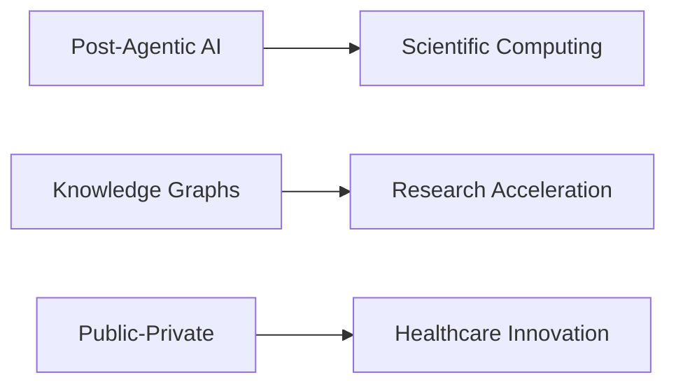

# Siddhartha Chaturvedi

<div align="center">
  
  
  <h3>Strategic AI Visionary • Founder</h3>
  <p><em>Building the post-agentic web for scientific discovery</em></p>
  
  [](https://siddharthachaturvedi.github.io)
  [](https://linkedin.com/in/siddharth)
  [](https://calendly.com/s-sidc/15min)
</div>

---

## 🎯 About

**Former Microsoft Director** pioneering next-generation AI systems for scientific discovery. Led AI innovations touching millions of lives through federal deployments, healthcare breakthroughs, and responsible technology development.

> *"Strategy without execution is hallucination. Execution without strategy is chaos."*

### 🚀 Current Focus
- **Post-agentic systems** for under-represented diseases
- Building beyond Human-AI augmentation toward research acceleration
- Transforming what-if moments into what's-next realities

---

## 🏆 Recognition

<table>
<tr>
<td width="50%">

### 🌟 Fast Company's World Changing Idea 2021
**Microsoft Premonition**  
Biothreat detection platform securing multi-million government contracts

</td>
<td width="50%">

### 🔬 Research Innovation
**Biomedical Search Platform**  
Advanced search transforming scientific discovery

</td>
</tr>
</table>

---

## 🔬 Current Investigations



| Focus Area | Description |
|------------|-------------|
| **Post-Agentic AI Systems** | Next-generation scientific computing platforms |
| **Scientific Knowledge Graphs** | Reimagining research connections and discovery |
| **Public-Private Innovation** | Healthcare partnerships through responsible AI |

---

## 💼 Advisory & Investment

<div align="center">

| Role | Organization | Focus |
|------|-------------|-------|
| **Limited Partner** | rpv (DeepTech VC) | Deep Technology Investments |
| **Advisor** | Loyal VC | Strategic Guidance |

</div>

### 🎯 Available For
- 🎤 **Keynote Speaking**
- 🏛️ **Board Positions** 
- 🤝 **Strategic Advisory**

---

## 🌐 Portfolio Website

This repository hosts a refined, minimal portfolio built with modern web technologies.

### ✨ Features

<div align="center">

| Feature | Description |
|---------|-------------|
| 📱 **Responsive Design** | Mobile-first, optimized for all devices |
| ♿ **Accessibility** | WCAG compliant with proper focus states |
| 🎨 **Modern CSS** | Custom properties, Grid, Flexbox |
| ⚡ **Performance** | Optimized fonts, images, animations |
| 🎭 **Scroll Snapping** | Smooth section navigation |

</div>

### 🛠️ Tech Stack

```
Frontend:  HTML5 • CSS3 • Vanilla JavaScript
Fonts:     Inter • Playfair Display
Hosting:   GitHub Pages
Design:    Mobile-first responsive
```

### 🎨 Design System

- **Typography**: Inter + Playfair Display pairing
- **Colors**: Off-white (#FEFEFE) with charcoal hierarchy
- **Layout**: Responsive grid with scroll-snapping
- **Interactions**: Subtle animations and transitions

---

## 📁 Project Structure

```
📦 siddharthachaturvedi.github.io
├── 📄 index.html              # Main portfolio page
├── 🎨 styles.css              # Complete design system
├── ⚡ script.js               # Interactive functionality
├── 📋 README.md               # This documentation
├── 📄 sidc_resume.pdf         # Resume/CV
└── ⚙️ .github/workflows/      # GitHub Pages deployment
```

---

## 🤝 Connect

<div align="center">

### Professional Networks

[](https://linkedin.com/in/siddharth)
[](./SIDDHARTHA%20CHATURVEDI.pdf)
[](./sidc_resume.pdf)

### 🌍 Location
**Based between US & Asia** • Available for global engagements

</div>

---

<div align="center">
  <sub>Built with ❤️ for scientific discovery and innovation</sub><br>
  <sub>© 2025 Siddhartha Chaturvedi • All rights reserved</sub>
</div>