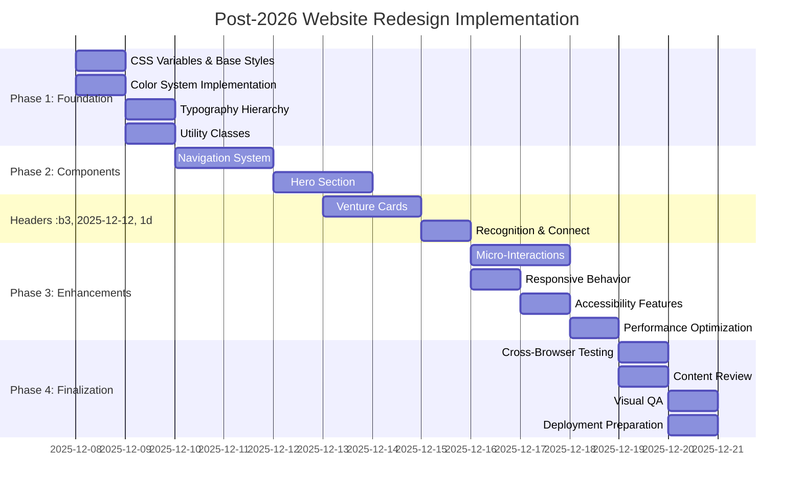

# Post-2026 Website Design Concept
## Visual Architecture for Siddhartha Chaturvedi

## Design Concept: "Neo-Futurist Command Center"

```mermaid
%%{init: {'theme': 'dark', 'themeVariables': {
    'primaryColor': '#00D4AA',
    'secondaryColor': '#FF6B9D',
    'tertiaryColor': '#88A0C8',
    'backgroundColor': '#0A0F14',
    'textColor': '#E8F2FF',
    'borderColor': '#2D3A4A'
}}}%%

mindmap
  root((Post-2026 Website Design))
    ::icon(fa fa-futbol)

    Design Philosophy
      Core Values Integration
        Innovation
        Responsibility
        Impact
        Collaboration
        Futurism
      Aesthetic Fusion
        Brutalist Tech
        Cyberpunk Aesthetics
        Minimalist Japanese

    Visual Identity
      Color System
        Dark Theme Primary
        Light Theme Secondary
        Electric Teal Accents
        Neon Pink Highlights
      Typography
        Space Grotesk Headlines
        Inter Body Copy
        JetBrains Mono Code
        Modular Type Scale

    UI Components
      Navigation
        Floating Control Panel
        Holographic Effects
        Dynamic Underlines
        Cyberpunk Slide-in
      Hero Section
        Digital Command Center
        Asymmetrical Layout
        Data Visualization
        Particle Effects
      Section Headers
        Brutalist Underlines
        Scan Line Backgrounds
        Animated Reveals
        Japanese Spacing
      Venture Cards
        Glowing Borders
        Parallax Previews
        Data Visualization
        Interactive Tooltips
      Recognition
        Achievement Terminal
        Animated Counters
        Cyberpunk Borders
        Minimalist Typography

    Interaction Design
      Micro-Interactions
        Glow Effects
        Ripple Feedback
        Hover States
        Click Responses
      Scroll Animations
        Fade-in Effects
        Staggered Grids
        Parallax Depth
        Viewport Triggers
      Page Transitions
        Color Shifts
        Pattern Changes
        Japanese Wipes
        Smooth Blends

    Technical Implementation
      CSS Architecture
        Utility-First
        BEM Naming
        Custom Properties
        Modular Components
      JavaScript
        Progressive Enhancement
        IntersectionObserver
        Event Delegation
        Performance Optimized
      Build Process
        CSS Minification
        JS Bundling
        Asset Optimization
        Critical Path

    Responsive Strategy
      Breakpoints
        Mobile: 420px
        Phablet: 560px
        Tablet: 768px
        Laptop: 1024px
        Desktop: 1280px
        Wide: 1440px
        Ultra: 1920px
      Patterns
        Mobile-First
        Touch Optimized
        Dynamic Typography
        Adaptive Layouts

    Accessibility
      Features
        High Contrast
        Reduced Motion
        Keyboard Nav
        ARIA Attributes
        Semantic HTML
      Performance
        Critical CSS
        Lazy Loading
        Animation Optimization
        Minimal JS
        Efficient DOM

%% Design Flow Diagram %%

flowchart TD
    A[User Arrives] --> B[Floating Nav Appears]
    B --> C[Hero Section Loads]
    C --> D[Asymmetrical Layout]
    D --> E[Data Streams Animate]
    E --> F[Scroll Triggered]
    F --> G[Section Reveals]
    G --> H[Venture Cards Glow]
    H --> I[Interactive Elements]
    I --> J[Smooth Transitions]
    J --> K[Engagement Complete]

%% Color Palette Visualization %%

classDiagram
    class DarkTheme {
        +bg-primary: #0A0F14
        +bg-subtle: #121A22
        +text-primary: #E8F2FF
        +accent-primary: #00D4AA
        +accent-secondary: #FF6B9D
    }

    class LightTheme {
        +bg-primary: #F8FAFF
        +bg-subtle: #EFF4FF
        +text-primary: #0A122A
        +accent-primary: #00A388
        +accent-secondary: #E64B7A
    }

    DarkTheme --|> LightTheme : Inherits Structure
```

## Key Design Elements

### 1. Navigation System - "Floating Control Panel"
```
┌─────────────────────────────────────────────────┐
│  [HOME]  [ABOUT]  [RECOGNITION]  [VENTURES]       │
│  [CURRENT]  [CONNECT]                            □│
└─────────────────────────────────────────────────┘
  ▁▁▁▁▁▁▁▁▁▁▁▁▁▁▁▁▁▁▁▁▁▁▁▁▁▁▁▁▁▁▁▁▁▁▁▁▁▁▁▁▁
```
*Features: Semi-transparent backdrop, glowing active state, cyberpunk toggle animation*

### 2. Hero Section - "Digital Command Center"
```
  [SIDDHARTHA CHATURVEDI]
  ───────────────────────────────
  /                               \
 /                                 \
[   PROFILE   ]    [MICROSOFT] [INSEAD]
 \                                 /
  \                               /
  ───────────────────────────────
  "Scaling multi-agentic AI to responsible impact"
  ▁▁▁▁▁▁▁▁▁▁▁▁▁▁▁▁▁▁▁▁▁▁▁▁▁▁▁▁▁▁▁▁▁▁▁▁▁▁▁▁▁
```
*Features: Asymmetrical layout, data stream background, 3D name effect*

### 3. Venture Cards - "Futuristic Data Panels"
```
┌─────────────────────────────────┐
│  [PREVIEW AREA]                  │
│  ┌─────────────────────────┐    │
│  │                         │    │
│  │    SCREENSHOT            │    │
│  │                         │    │
│  └─────────────────────────┘    │
│                                     │
│  SAMVIDHAAN.AI                      │
│  Co-Founder                         │
│  Giving solo-practicioners...      │
│  [VISIT →]                         │
└─────────────────────────────────┘
  ██████████████████████████████████
```
*Features: Glowing borders, parallax preview, interactive tooltips*

## Implementation Roadmap



## Design Validation Checklist

- [ ] Color contrast meets WCAG AA standards (4.5:1 minimum)
- [ ] All interactive elements have visual feedback states
- [ ] Responsive behavior tested across all breakpoints
- [ ] Animation performance maintains 60fps on target devices
- [ ] Content hierarchy is clear and logical
- [ ] Brand values are visually represented throughout
- [ ] Design feels unique and non-generic
- [ ] Cross-browser compatibility verified (Chrome, Firefox, Safari, Edge)
- [ ] Comprehensive accessibility audit completed
- [ ] Performance budget met (< 1s load time, < 300KB CSS/JS)

This visual concept illustrates how we'll transform your website into a cutting-edge digital presence that reflects your strategic vision while maintaining approachability and professionalism.